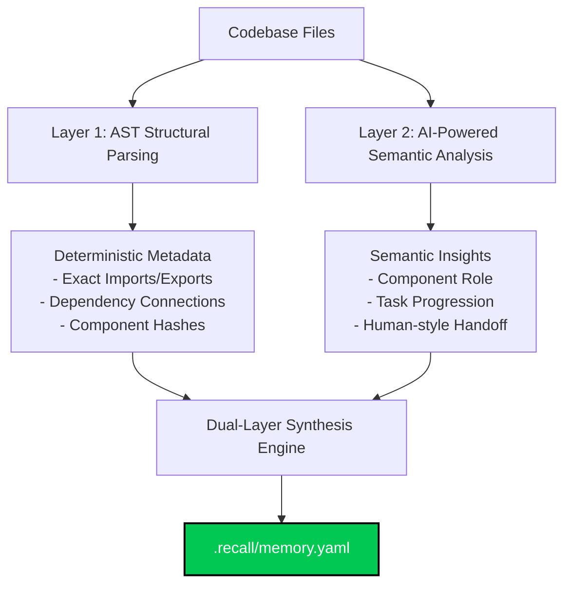

# context-memo 🧠

**Hybrid AI Memory Layer: Local Knowledge Graph + AI-Powered Reasoning**

Never lose context when switching AI coding agents. context-memo combines local code analysis (Graphify-style) with AI-powered task reasoning to create persistent memory that survives agent switches.

## The Problem

When working with AI coding agents (Claude, Cursor, Windsurf, Copilot, etc.) and your credits run out or you switch accounts — the new AI agent has ZERO memory of the project. You waste time and tokens re-explaining everything from scratch.

## The Solution: Dual-Layer Hybrid Scan

`context-memo` solves this problem by using a **Dual-Layer Hybrid Scan Engine** that separates deterministic code structure analysis from high-level semantic reasoning:

1. **Layer 1: Structural Parsing (Deterministic & Private)**
   - Babel AST-based local parsing extracts imports, exports, symbols, and code trees.
   - Maps file relationships and imports **locally and with 100% accuracy**.
   - **Zero AI hallucinations** for codebase structure, dependencies, or function exports.

2. **Layer 2: Semantic Reasoning (AI-Powered via Gemini)**
   - Uses the Gemini API strictly for what it excels at: analyzing the project's high-level purpose, progress, broken features, and drafting contextual developer handoff briefs.
   - Prompt format is heavily optimized, excluding deep syntax to minimize token usage.

3. **Layer 3: Orchestrated Synthesis**
   - The scanner merges deterministic local code analysis and AI reasoning into a cohesive `.recall/memory.yaml` briefing.
   - Employs **Incremental Change Detection** via MD5 file hashes, scanning only modified files to save 60-90% of prompt tokens on subsequent scans.

## Features

- 🔍 **Local Knowledge Graph** — Analyzes code structure without API calls
- 🧠 **AI-Powered Reasoning** — Uses Gemini for deep insights
- 🔗 **History Grounding** — Ground AI reasoning against your local session history (optional)
- 📊 **Incremental Updates** — Only scans changed files (saves 60-90% tokens)
- � **Privacy Mode** — Local-only scanning (--local flag)
- 🎯 **Exact Continuation** — Tells next agent exactly where to continue
- 📝 **Decision Log** — Tracks key architectural decisions
- 🤖 **Agent Integration** — Works with Claude, Cursor, Windsurf, Copilot, Aider, etc.
- 👀 **Auto-Scan** — Watch mode for active development
- 🆓 **100% free** — Uses Gemini 2.5 Flash Lite API (no credit card needed)
- 💰 **Token Efficient** — Incremental scans save massive amounts of tokens

## Installation

```bash
npm install -g context-memo
```

## Quick Start

```bash
# 1. Initialize in your project
memo init

# 2. Set your free Gemini API key
memo config --key YOUR_KEY

# 3. Scan your project
memo scan

# 4. Load the briefing (copies to clipboard)
memo load
```

Paste the briefing into your AI agent and it instantly understands your entire project.

## Getting a Free Gemini API Key

1. Visit: https://aistudio.google.com/app/apikey
2. Click "Create API Key" (no credit card required)
3. Copy your key
4. Run: `memo config --key YOUR_KEY`

## Optional: Install Local History CLI for Grounded Reasoning

`context-memo` integrates with a local history command-line indexer to ground AI reasoning in your actual past session history. This allows `context-memo` to check if a proposed step was previously tried and failed, preventing unsupervised agent runs from looping on dead ends.

Installing the history indexer is entirely optional, and `context-memo` will work identically without it if missing.

To enable history grounding:
1. Install the history indexer CLI via its official installation instructions.
2. Run the history indexer in your projects to record session history.
3. `context-memo` will automatically detect the indexer at runtime and configure `historyEnabled` to `true`.
4. Configure limits or disable it at any time:
   ```bash
   memo config --history-enabled false
   memo config --history-limit 5
   ```

## Commands

### `memo init`
Initialize `.recall/` folder in your project with blank templates.

### `memo scan [--quick] [--local]`
Scan entire project and generate memory.

**Modes:**
- **First scan**: Full analysis with AI
- **Subsequent scans**: Incremental (only changed files) — saves 60-90% tokens
- **--quick**: Faster scan with fewer files
- **--local**: Privacy mode (no API calls, local analysis only)

**What it does:**
1. Builds local knowledge graph (imports, exports, dependencies)
2. Detects changed files (incremental updates)
3. Identifies "god nodes" (most critical components)
4. Calls Gemini API (only for changes, or skip with --local)
5. Generates comprehensive memory.yaml

**Token optimization:**
- First scan: ~15,000 tokens
- Incremental scan: ~2,000-5,000 tokens (60-90% savings!)
- Local mode: 0 tokens

### `memo watch` 🆕
Watch project and auto-scan on file changes.
- Monitors code files for changes
- Auto-scans 10 seconds after changes stop
- Uses incremental scanning (saves tokens)
- Perfect for active development
- Press Ctrl+C to stop

### `memo load [--mode=quick|full|onboard]`
Load and display agent briefing (copies to clipboard).
- `full` (default): Complete briefing (~2000 tokens)
- `quick`: Condensed briefing (~400 tokens)
- `onboard`: Full briefing + asks agent to confirm understanding

### `memo status`
Show terminal dashboard with project status, progress, components.

### `memo update [message]`
Update task state and progress interactively.

### `memo install <agent>`
Install context-memo integration for AI agents:
- `claude` → `.claude/CLAUDE.md`
- `cursor` → `.cursor/rules/context-memo.md`
- `windsurf` → `.windsurf/rules/context-memo.md`
- `copilot` → `.github/copilot-instructions.md`
- `aider` → `.aider.conf.yml`
- `antigravity` → `.antigravity/rules.md`

### `memo config [--key KEY] [--show]`
Configure settings (API key stored at `~/.recall/config.json`).

### `memo validate`
Validate repository code for hallucinations and errors.

**What it does:**
1. Syntax validation (AST parsing)
2. Import validation (verify all imports exist)
3. Symbol validation (verify all symbols exist)
4. Path validation (verify all paths are valid)
5. Generates confidence score

### `memo health [--format full|summary] [--save]`
Display repository health dashboard with metrics and recommendations.

**What it shows:**
- Overall health score (0-100) with grade
- God files (highly connected files)
- Circular dependencies
- Architecture drift
- Bottlenecks and unstable modules
- Orphaned files
- Complexity hotspots
- Actionable recommendations

### `memo trust [--format full|summary] [--save]`
Display AI trust meter with confidence metrics.

**What it shows:**
- Overall trust score (0-100) with grade
- Symbol verification rate
- Import validation rate
- Hallucination risk assessment
- Validation history and trends
- Verified/unverified symbols
- Recommendations

### `memo timeline [--file <path>] [--compare id1,id2] [--save]`
Display edit replay timeline with change history.

**What it shows:**
- Recent changes with timestamps
- Impact analysis (blast radius, risk score)
- Most changed files
- High risk changes
- Change comparison
- 7-day activity visualization

### `memo local <action> [options]`
Manage local-first runtime for offline operation.

**Actions:**
- `init` — Initialize local runtime (Ollama integration)
- `status` — Check runtime status
- `test` — Test models
- `search` — Semantic search with local embeddings
- `analyze` — Analyze code locally
- `embeddings` — Manage embedding cache

## How It Works: The Dual-Layer Synthesis



### The Scan Flow:

1. **Step 1: File & Change Detection**: Scanner runs locally, hashes files (MD5), and computes changed/added/deleted files since the last scan (saving 60-90% tokens).
2. **Step 2: Local Structural Scan**: Local parser builds the dependency graph, identifies "god nodes" (critical files), and writes all import-export bindings deterministically.
3. **Step 3: AI Prompting**: Prompt compiler builds a lean task context and invokes the Gemini API.
4. **Step 4: Synthesis & Verification**: The scan orchestrator merges structural dependencies with Gemini's semantic insights, validating the output schema before saving the verified `.recall/memory.yaml` briefing.

### The Efficiency & Accuracy Result:
- **Zero Hallucinations**: Components and connections are 100% verified locally.
- **First Scan**: `memo scan` → Full analysis (optimized context).
- **Subsequent Scans**: `memo scan` → Incremental scan (sends only delta, **saving ~90% tokens**).
- **No Changes**: `memo scan` → Instantly reuses existing memory without invoking the API.
- **Privacy Mode**: `memo scan --local` → 100% local analysis, bypasses Gemini API completely.

## Memory Structure

`.recall/memory.yaml` contains:

- **Project DNA**: name, purpose, stack, constraints
- **Knowledge Graph**: components, dependencies, data flow, god nodes
- **Progress**: what works, what's broken, what's missing, tech debt
- **Task State**: last task, current problem, exact continuation point
- **Decisions**: key architectural decisions with reasoning
- **Handoff Message**: 4-6 sentence summary for new agents

## Example Workflow

```bash
# Day 1: Start project with Claude
memo init
memo scan
memo load  # Paste into Claude

# ... work with Claude until credits run out ...

# Day 2: Switch to Cursor
memo update  # Update progress
memo load    # Paste into Cursor
# Cursor instantly knows everything!

# Day 3: Switch to Windsurf
memo load    # Paste into Windsurf
# No re-explanation needed!
```

## Use Cases

- 💳 **Credits ran out** — switch to different AI agent without losing context
- 👥 **Team handoffs** — new developer gets instant project understanding
- 🔄 **Context switching** — return to project after weeks away
- 🤖 **Multi-agent workflows** — use different agents for different tasks
- 📚 **Documentation** — auto-generated project memory as documentation

## File Structure

```
your-project/
├── .recall/
│   ├── memory.yaml        ← Complete project memory
│   ├── task_state.yaml    ← Current task state
│   ├── decisions.log      ← Decision history
│   └── .gitkeep          ← Commit this folder!
```

## Tips

- Run `memo scan` after major changes
- Run `memo update` before switching agents
- Use `memo watch` during active development for auto-updates
- Commit `.recall/` folder to git for team sharing
- Use `memo status` for quick project overview
- Use `--quick` flag for faster scans during development

## Auto-Scan Options

### Option 1: Watch Mode (Recommended for Development)
```bash
memo watch
```
Automatically scans when you save files. Perfect for active development!

### Option 2: Git Hook (Recommended for Teams)
```bash
# Run setup script
bash setup-auto-scan.sh    # Unix/Mac/Linux
setup-auto-scan.bat         # Windows
```
Automatically scans before every git commit. Great for keeping team memory in sync!

### Option 3: Manual
```bash
memo scan
```
Run manually when you want to update the memory.

## Tech Stack

- Node.js (ES modules)
- Gemini 1.5 Flash API (free tier)
- commander, js-yaml, chalk, inquirer, clipboardy

## Requirements

- Node.js >= 18.0.0
- Free Gemini API key

## License

MIT

## Contributing

Issues and PRs welcome!

## Credits

Inspired by:
- Graphify (knowledge graphs for code)
- Agent handoff patterns
- The pain of losing AI context when switching agents

---

**Never lose AI context again. One command. Instant understanding.**
